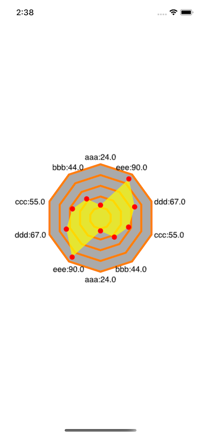

# RadarGraphDemo

A simple radar graph 



#### How to use it?

```objc
RadarGraphView *radar = [[RadarGraphView alloc] initWithTitles:@[@"aaa", @"bbb", @"ccc", @"ddd", @"eee",@"aaa", @"bbb", @"ccc", @"ddd", @"eee"] titleFont:15];
radar.radius = 100;
radar.values = @[@24, @44, @55, @67, @90, @24, @44, @55, @67, @90];
radar.titleStrColor = [UIColor blackColor];
radar.lineColor = [UIColor orangeColor];
    
radar.backgroundColor = [UIColor whiteColor];
radar.frame = CGRectInset(self.view.bounds, 0, 50);
radar.backgroundColor = [UIColor whiteColor];

[self.view addSubview:radar];
```

